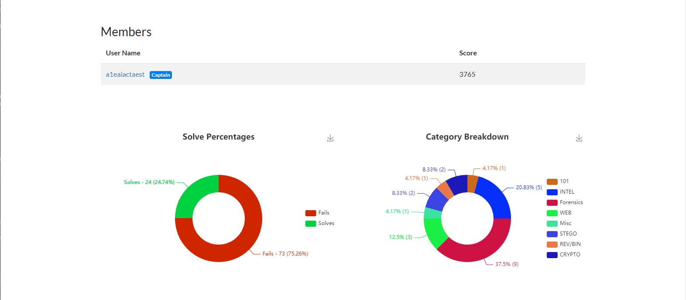

# RITSEC CTF 2021

> Time: Friday, 09 Apr 2021, 18:00 CEST — Sunday, 11 Apr 2021, 18:00 CEST   
> Format: Jeopardy    
> [CTFtime.org](https://ctftime.org/event/1309)

> Place: 66th   
> Points: 3765   

## Index

- rev/bin
  - snek `100`
  - Fleshwound `200`
  - Baby Graph `231`
  - Memedrive `275`
  - Baby WASM `485`
  - SamuraiInfection `500`
  - Teen WASM `500`
  - Un-machined Aerial System `500`
- crypto
  - What an Enigma? `100`
  - lorem ipsum `150`
  - RITSEC Hash `250`
  - Streams and Rivers `399`
  - Lost in Runs `400`
  - Feedback `500`
  - Throw it in REverse `500`
- forensics
  - 1597 `100`
  - BIRDTHIEF Series `Total: 1150`  
  - Inception Series `Total: 925`
  - PleaseClickAlltheThings Series `Total: 700`
  - 1597 `100`
  - Blob `200`
  - Parcel `200`
  - IFTPP `500`
- misc
  - Answers `100`
  - [Revision](misc/revision.md) `200`
  - Corruption `500`
- stego
  - The Lost Photo of Freg `350`
  - In Scope `382`
- intel/osint
  - [Finding Geno](osint/finding-geno.md) `50`
  - [Data Breach](osint/data-breach.md) `175`
  - [Music Signs](osint/music-signs.md) `225`
  - [#OSINTChallenge](osint/osintchallenge.md) `250`
  - [APT Interference](osint/aptinterference.md) `300`
  - Bad Traffic `350`
- web
  - Robots `100`
  - Sessions `100`
  - DababyWeb `150`
  - Revolution `250`

## Stats

  

---

  

