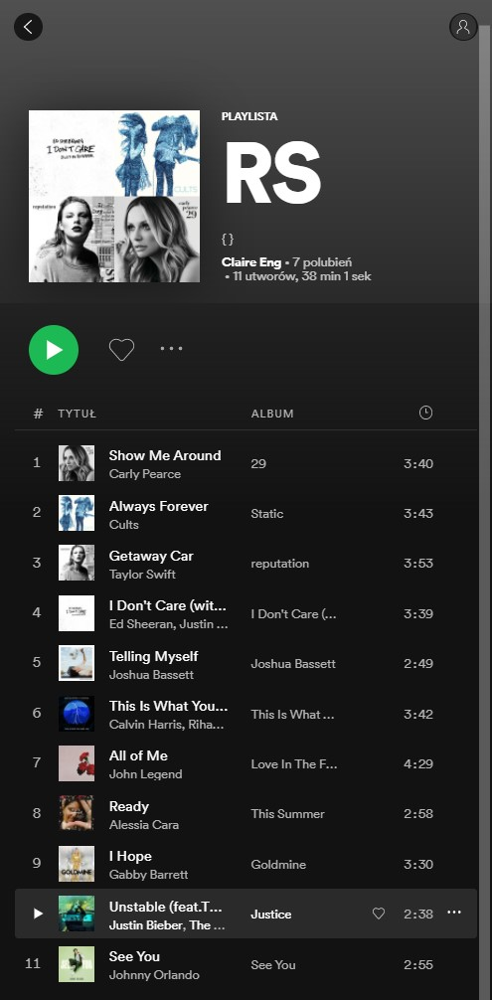

> # Music Signs   
> ## Points: 225   
> Geno occasionally keeps up with his ex’s music interests. What do they say about her personality?   
>    
> Author: Brendy

## Solution

For context please visit [this](https://github.com/a1eaiactaest/writeups/blob/main/ritsec2021/osint/finding-geno.md) writeup.

Visting Geno's twitter we can see that his recent [post](https://twitter.com/GenoIkonomov/status/1373331634104193024) has few comments. They belong to the Geno's ex.   
Let's check her profile.  
In [bio](https://twitter.com/eng_claire) she has a bitcoin adress and link to the Spotify [profile](https://open.spotify.com/user/31aa7nueamsbopacnwrtxp7e7zym?si=QfoXFXMKSMK6FXwwu-CiwA&utm_source=copy-link&nd=1). 

In the description there's music mentioned so let's check the Spotify.   
Claire has only one playlist named `RS`.  
Playlist containts few songs, at the first glance everything seems normal, but if you'll look close you can see that first letter of each song arrange into `sagittarius`.  

  

Hence the flag is `RS{sagittarius}`
