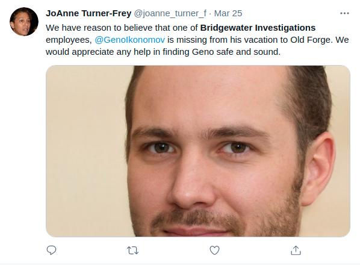
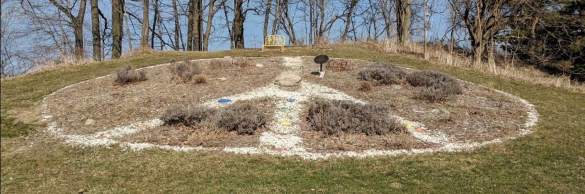
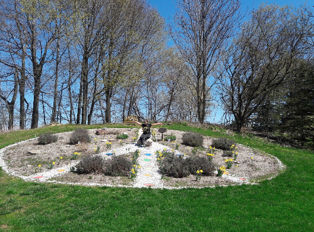

> # \#OSINTChallenge
> ## Points: 250
> The CEO of Geno’s company loves local art and nature. Where was she when she took the photo in her Twitter background? (Wrap the answer in RS{} and use underscores between each word.)   
> 
> Author: FrozenTundras

## Solution

As we found Geno's [linkedin page](https://www.linkedin.com/in/geno-ikonomov/) in the earlier challenges. He had his company's CEO in contacts. Unfortunately we can't find her twitter profile. 

Let's search on twitter for [bridgewater investigatins](https://twitter.com/search?q=bridgewater%20investigations&src=typed_query). At the time of writing this writeup the post about Geno's missing is third in the output.

Let's check her profile. In the background we have this picture:

We know that she lives in Rochester, NY. Let's search in google maps for `peace sign rochester`.
The `Peace Sign Garden Durand Eastman Park` pops up.  
Let's check if it's what we are looking for.  
On the third image we know it's the place we are looking for.

And flag is `RS{Durand_Eastman_Park}`
